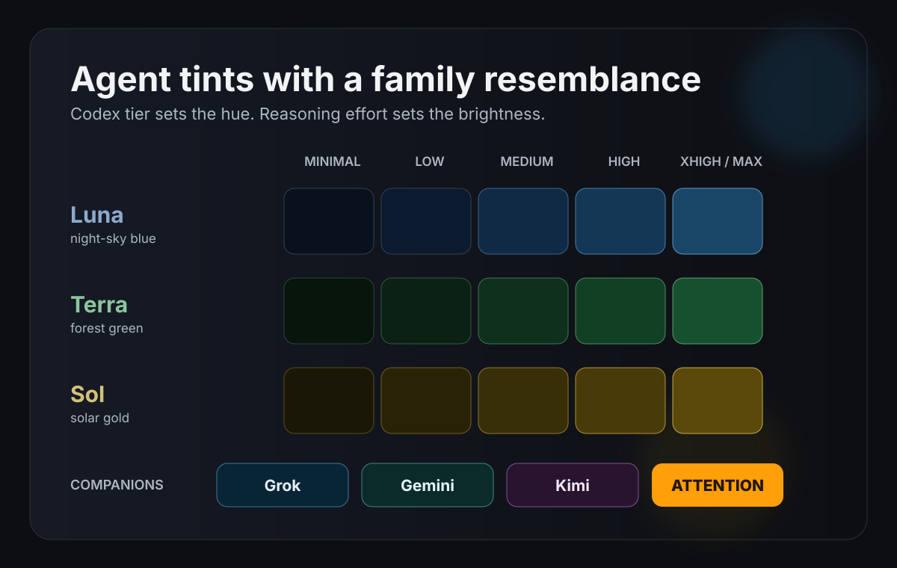
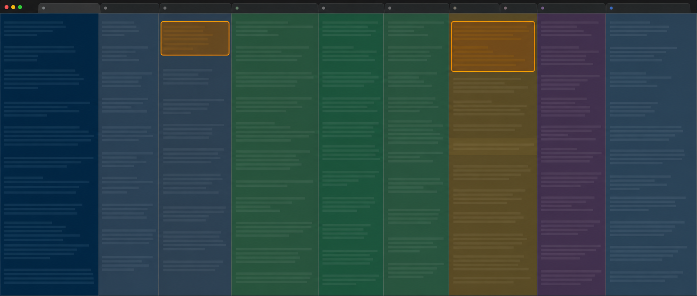

# iTerm Tab Shader



iTerm Tab Shader gives long-running agent tabs a quiet, recognisable background
wash. Codex uses a tier-and-effort palette. Claude, Grok, Gemini, and Kimi get
their own companion shades. An optional iTerm2 monitor adds a native orange tab
highlight and `ATTENTION` badge when an agent finishes in another tab.



*A redacted visual derivative of a busy iTerm working window. All real tab and
terminal text has been replaced.*

The project is for macOS, iTerm2, and interactive zsh. It is deliberately small:
a sourced zsh file, two local Python helpers, no server, and no telemetry.

## The palette

Codex's tier names lend themselves to a useful visual mnemonic. Sol is solar
gold, Terra is forest green, and Luna is night-sky blue. Within a tier, a higher
reasoning effort uses a brighter shade. The shade communicates the selected
configuration, not a claim about model quality or cost.

| Codex tier | Minimal | Low | Medium | High | Xhigh or max |
| --- | --- | --- | --- | --- | --- |
| Luna | `#08111c` | `#0b1b2d` | `#102945` | `#143755` | `#194667` |
| Terra | `#07150c` | `#0a2113` | `#0e301c` | `#124025` | `#17502f` |
| Sol | `#1b1706` | `#292206` | `#382e08` | `#493b09` | `#5a490b` |

Grok defaults to deep cyan (`#082536`), Gemini to dark teal (`#0b2b2b`), and
Kimi to plum (`#291430`). Set `ITERM_TAB_SHADER_GROK_HEX`,
`ITERM_TAB_SHADER_GEMINI_HEX`, or `ITERM_TAB_SHADER_KIMI_HEX` to make a local
palette your own.

## Install

Clone the repository where the shell can find it, then source the zsh file from
`~/.zshrc`.

```zsh
git clone https://github.com/zcor/iterm-tab-shader.git ~/.config/iterm-tab-shader

# Add this line to ~/.zshrc
[[ -r "$HOME/.config/iterm-tab-shader/iterm-tab-shader.zsh" ]] && source "$HOME/.config/iterm-tab-shader/iterm-tab-shader.zsh"
```

Open a fresh iTerm tab or source the file. The `codex`, `claude`, `grok`,
`gemini`, and `kimi` commands are then wrapped only when they run inside iTerm2.
Outside iTerm2 they pass directly to the underlying command.

Run `iterm-tab-shader-demo` to walk through the fifteen Codex colours. Any key
moves to the next one and the last step restores iTerm's profile background.

### Live Codex model changes

The `codex` wrapper uses the launch arguments or `~/.codex/config.toml` for the
first shade. A small broker then extracts model and effort changes from the
local Codex diagnostic SQLite database. Each update is scoped to the Codex
process on its terminal, so `/model` keeps working in long-lived tabs without
confusing neighbouring tabs.

All active tabs share one broker, one persistent read-only database connection,
and one incremental query per polling interval. Each tab watches a tiny local
state file. This preserves live tracking without launching two `sqlite3`
processes per tab every second. The broker exits after the last Codex tab has
been gone for 60 seconds, and stale registrations are removed automatically.
Orphaned state and temporary files are also swept by the broker.

This is a local, read-only compatibility feature. It extracts no prompts,
responses, credentials, or account data, and it makes no network connection.
Its private runtime files contain only a process ID, model slug, and effort
name. The database schema is not a public contract, so this extra tracking may
need an update after a Codex release. To keep the launch shade but disable
tracking:

```zsh
export ITERM_TAB_SHADER_CODEX_LIVE=0
```

The defaults favour quick visual feedback and modest cleanup latency. They can
be tuned without changing the code:

```zsh
export ITERM_TAB_SHADER_CODEX_POLL_SECONDS=0.5
export ITERM_TAB_SHADER_BROKER_IDLE_SECONDS=60
export ITERM_TAB_SHADER_RUNTIME_DIR="${TMPDIR:-/tmp}/iterm-tab-shader"
```

Unknown model names use neutral slate (`#23232a`).

### Claude statusline companion

Claude's statusline process cannot safely tint a terminal itself. The optional
companion reports only the displayed model name to a short-lived local file;
the shell wrapper owns the terminal escape sequence. Configure Claude Code's
statusline command to run:

```text
$HOME/.config/iterm-tab-shader/scripts/claude-statusline.sh
```

The script also prints a compact statusline. It receives Claude's normal
statusline JSON and writes no project path or prompt content to the tint file.

### Attention tabs

The attention monitor needs iTerm2's Python API in the Python interpreter that
will run it:

```zsh
python3 -m pip install --user iterm2
iterm-tab-shader-attention start
```

Start it from a shell in the iTerm window to watch. It polls that one window,
marks a Claude title that gains a leading `✳`, and notices a Codex tab whose
Braille work spinner disappears. A pending pane receives an `ATTENTION` badge
and its enclosing tab becomes orange. The tab returns to its prior colour only
after every pending pane in it has received focus.

The monitor never sends text, escape sequences, AppleScript input, or PTY bytes
to an agent terminal. It uses iTerm's session-local profile API for the tab and
badge. It can optionally make a local macOS `Funk` sound at a pitch based on the
displayed tab position. Use `iterm-tab-shader-attention start --no-sound` for a
silent monitor, or `stop` and `status` to manage it.

The title rules are observed behaviour, not a documented promise from either
agent. If a release changes them, inspect the iTerm titles before broadening the
detector.

## Safety and privacy

This repository contains no host rules, SSH wrappers, remote audio routes,
browser automation, credentials, cookies, tokens, personal paths, or captured
terminal output. Its runtime makes no network requests.

The monitor snapshots and restores only the iTerm profile settings that it
changes. It never changes the saved iTerm profile. Its cache contains generated
local sound files and a process lock. The Codex database read is optional and
read-only. See [SECURITY.md](SECURITY.md) before proposing integrations that
would widen those boundaries.

The raw terminal screenshot is intentionally not included. Even a blurred
capture can preserve project names, tab titles, and terminal details. The
panorama above preserves no real tab or terminal text, and the palette image is
a deterministic SVG with no user data.

## Development

Live Codex tracking requires Python 3.10 or newer and uses only the standard
library. Launch-time tinting still works without it. The attention monitor uses
the same Python baseline and needs the optional `iterm2` package only when it is
run inside iTerm2.

```zsh
make check
```

`make check` runs the zsh palette checks, Python helper tests, compilation, and
a public-tree audit for secrets and accidental local paths.

Codex, Claude, Grok, Gemini, Kimi, and iTerm2 are trademarks of their respective
owners. This project is independent and is not affiliated with or endorsed by
any of them.

MIT licensed.
